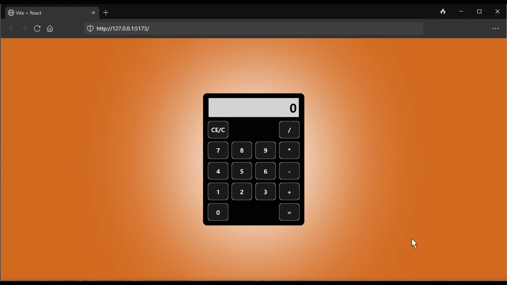

# Simple Calculator

## Video

## Description

The App displays a calculator.
 
The calculator can add, subtract, multiply and divide.

## Installing and start up

Install dependencies by running the command npm install.
 
Start the program by running the command npm run dev in the terminal.

## Project details

This project is made with React+Vite and runs on localhost (http://127.0.0.1:5173/).

## Design decisions

The App is written using Hooks (New React).
 
The App is divided into components that use helpers from theutils folder.
 
Styles are created with CSS.

## NB

Calculator does not show very big or very small numbers correctly.
 
You cannot add decimal numbers.

## Known errors

-
